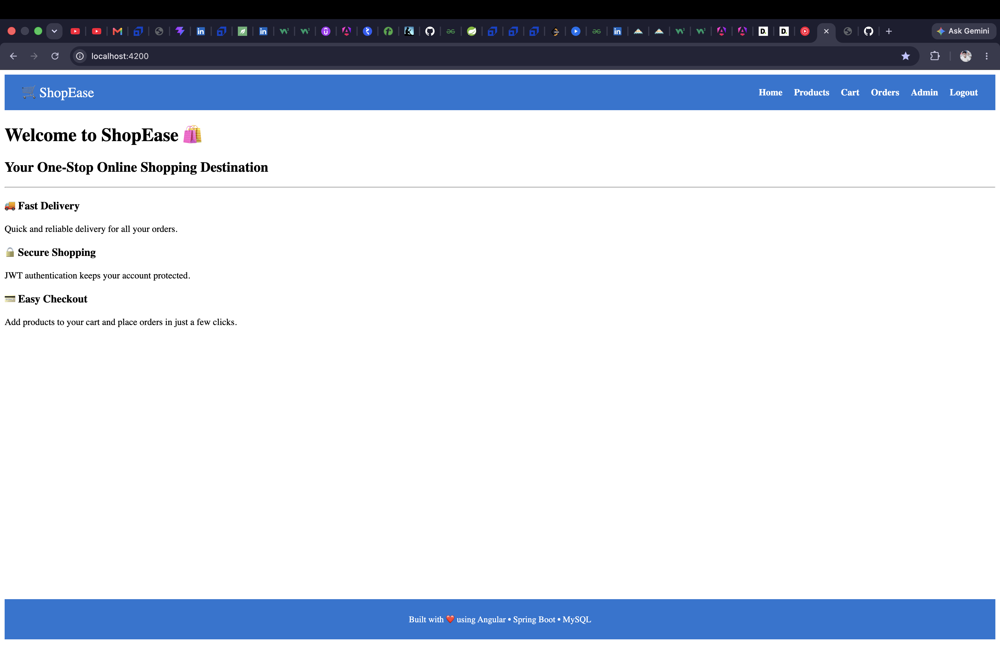
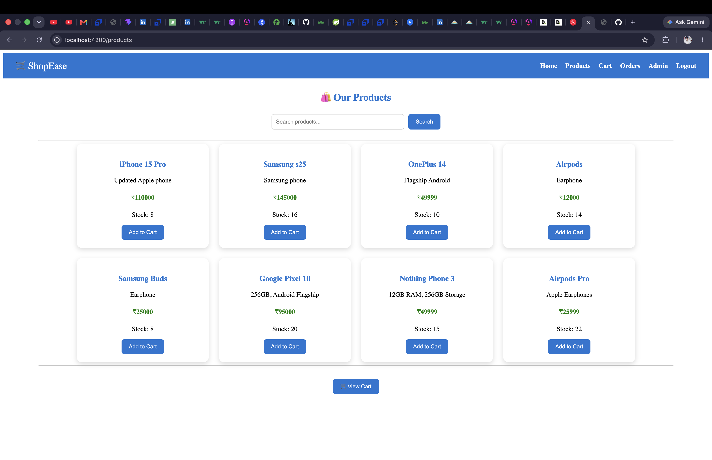
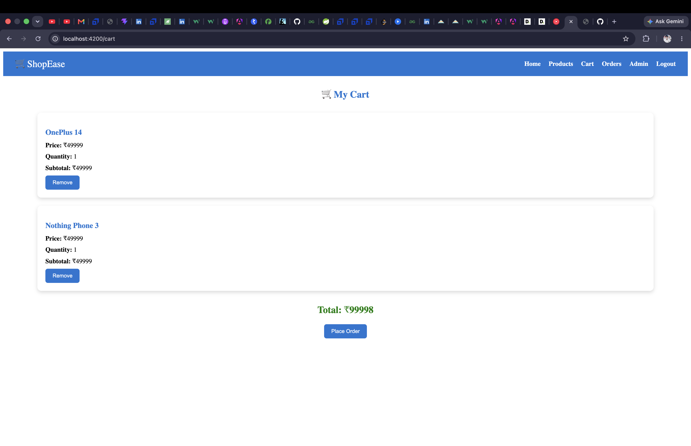
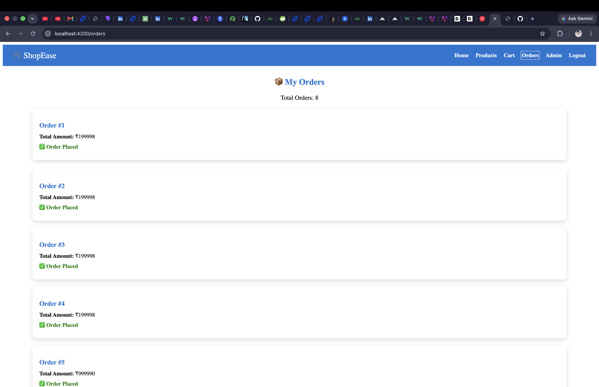
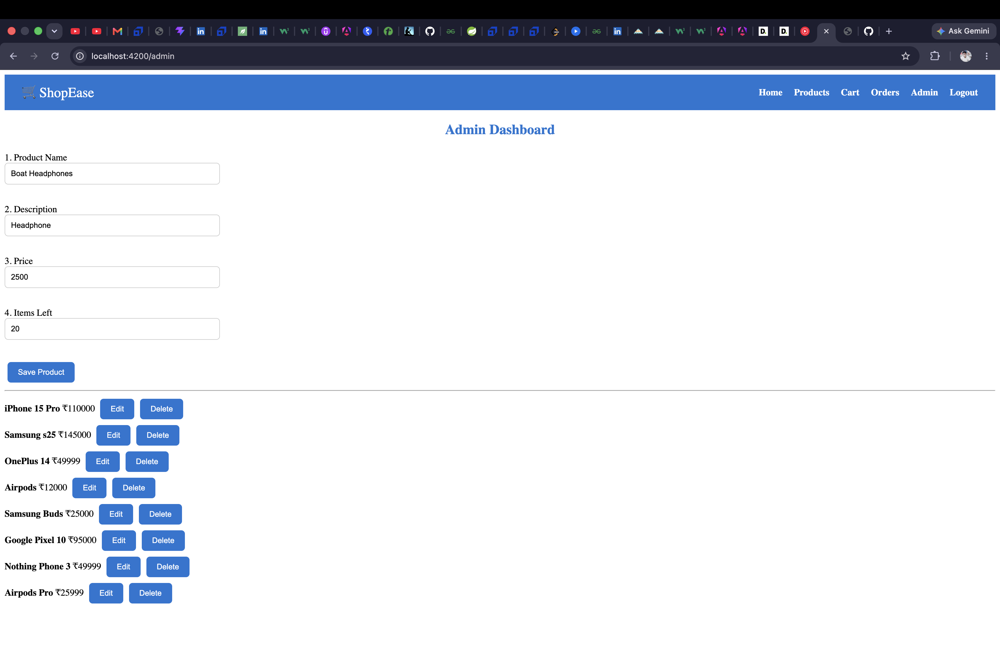
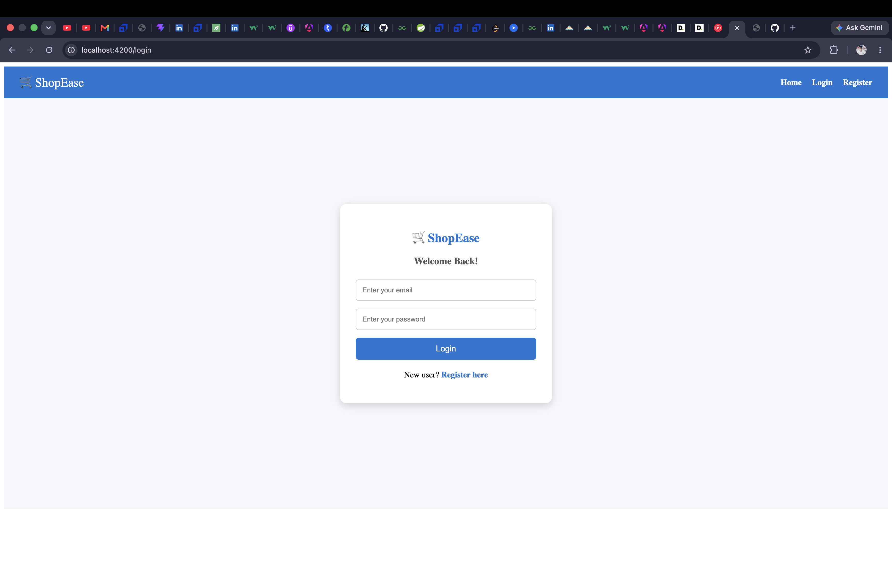
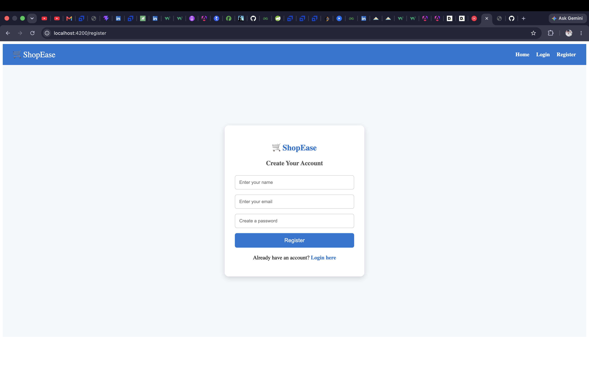

    
# 🛒 ShopEase - Full Stack E-Commerce Application

ShopEase is a full-stack e-commerce application built using Angular, Spring Boot, and MySQL. It allows users to browse products, search items, manage a shopping cart, place orders, and provides an admin dashboard for product management.

## 🚀 Features

- User Registration & Login
- JWT Authentication
- Product Management (Admin)
- Product Search
- Shopping Cart
- Place Orders
- Order History
- Stock Management
- Responsive Angular UI
- RESTful API Integration

## 🛠 Tech Stack

### Frontend
- Angular
- TypeScript
- HTML
- CSS

### Backend
- Java 21
- Spring Boot
- Spring Security
- Spring Data JPA
- Hibernate

### Database
- MySQL

### Tools
- Git
- GitHub
- Maven
- Eclipse
- VS Code
- Postman

## 📂 Project Structure

```text
ShopEase
├── ecommerce-backend
└── ecommerce-frontend
```

## ▶️ Running the Project

### Backend
1. Open `ecommerce-backend`.
2. Configure MySQL in `application.properties`.
3. Run the Spring Boot application.

### Frontend
1. Open `ecommerce-frontend`.
2. Run `npm install`.
3. Run `ng serve`.
4. Visit `http://localhost:4200`.

## 📸 Screenshots
### Home


### Products


### Cart


### Orders


### Admin Dashboard


### Login


### Register

## 📸 Screenshots


## 🔮 Future Enhancements

- Product images
- Pagination
- Payment gateway integration
- User profile management
- Order tracking
- Deployment to cloud

## 👨‍💻 Author

**Sudhir Sahoo**